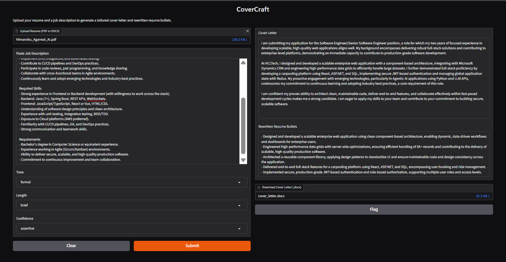

# CoverCraft

Part of the **JobPilot** project series — a multi-agent job search assistant.

## What this does

CoverCraft takes a resume and a job description, and generates:
- A tailored cover letter, downloadable as a `.docx` file
- 3-5 rewritten resume bullet points, reframed to match the job description's language and priorities

Both outputs are grounded strictly in the candidate's real resume content — the generation prompt explicitly forbids fabricating skills or achievements not present in the original resume.

## Screenshot



## Features

- Resume parsing (PDF and DOCX)
- Style-guided generation: tone (formal/conversational), length (brief/detailed), confidence (humble/assertive)
- Anti-generic-AI prompting — explicitly avoids filler phrases like "team player" or "passionate about"
- Downloadable cover letter as a Word document
- Optional integration point for ResumeFitCheck output (strong matches / gaps) to sharpen the generated content
- Clear error handling for invalid resumes, empty job descriptions, and API failures

## Approach: Style-Guided Prompting (not RAG)

This version uses **style preference dropdowns** rather than a RAG pipeline over personal writing samples. The reasoning: authentic voice-matching via RAG requires real writing samples (past cover letters, posts, etc.) which weren't available at build time. Style-guided prompting is a simpler, still-effective approach that lets the user steer tone and confidence directly.

**Planned future enhancement:** once real writing samples are available, add a RAG layer (chunking + embeddings + a vector store like Chroma) to retrieve authentic voice patterns and further personalize output beyond just tone/length/confidence sliders.

## Tech Stack

- **Backend:** Python, FastAPI
- **LLM:** Google Gemini API
- **Frontend:** Gradio
- **Parsing:** pdfplumber, python-docx
- **Document export:** python-docx
- **Data validation:** Pydantic

## Setup

### 1. Backend setup
```bash
cd backend
python -m venv venv
source venv/bin/activate  # or venv\Scripts\activate on Windows
pip install -r requirements.txt
cp .env.example .env
```
Add your Gemini API key to `.env`:
```
GEMINI_API_KEY=your_gemini_api_key_here
```

### 2. Run the FastAPI backend
```bash
uvicorn main:app --reload
```
Visit `http://127.0.0.1:8000/docs` to test the `/generate` endpoint directly.

### 3. Run the Gradio frontend
In a separate terminal (same venv activated):
```bash
python app.py
```

## Style Preference Options

| Preference | Options | Effect |
|---|---|---|
| Tone | `formal`, `conversational` | Adjusts overall writing register |
| Length | `brief`, `detailed` | Controls paragraph count (3 vs 4-5) |
| Confidence | `humble`, `assertive` | Adjusts how directly achievements are framed |

## API Reference

The `/generate` endpoint accepts a multipart form request with:

| Field | Type | Required | Description |
|---|---|---|---|
| `resume` | file | Yes | Resume file (`.pdf` or `.docx`) |
| `jd_text` | string | Yes | Job description text |
| `tone` | string | No | `formal` or `conversational` (default: `formal`) |
| `length` | string | No | `brief` or `detailed` (default: `brief`) |
| `confidence` | string | No | `humble` or `assertive` (default: `assertive`) |

Response includes `cover_letter` (string) and `rewritten_bullets` (list of strings).

## Project Structure

```
covercraft/
├── backend/
│   ├── main.py               # FastAPI app and /generate endpoint
│   ├── app.py                 # Gradio frontend
│   ├── generator.py           # Prompt building + Gemini API call
│   ├── document_export.py     # docx generation for downloads
│   ├── resume_parser.py       # Reused from ResumeFitCheck
│   ├── jd_handler.py          # Reused from ResumeFitCheck
│   ├── models.py              # Pydantic schemas
│   ├── outputs/               # Generated cover letters (gitignored)
│   ├── requirements.txt
│   └── .env.example
├── .gitignore
└── README.md
```

## Part of JobPilot

This is one of five standalone sub-projects that combine into the final **JobPilot** multi-agent system:
1. ResumeFitCheck — resume/JD scoring
2. JobScout — job search & recommendations
3. **CoverCraft** (this repo) — AI cover letter writer
4. ApplyTrack — application tracker
5. JobPilot — final orchestration of all agents
